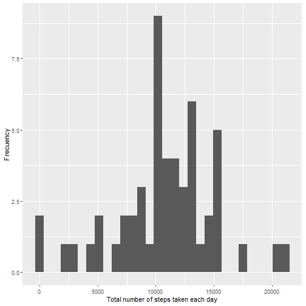
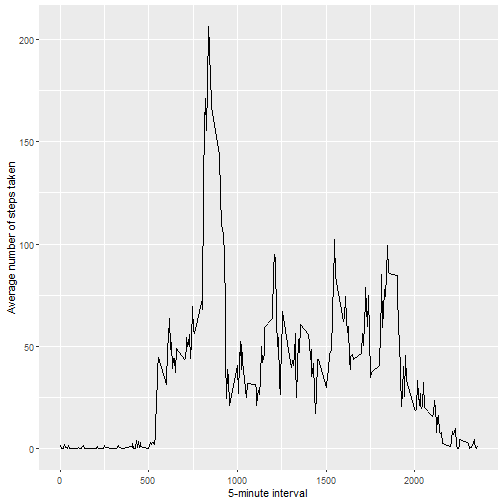
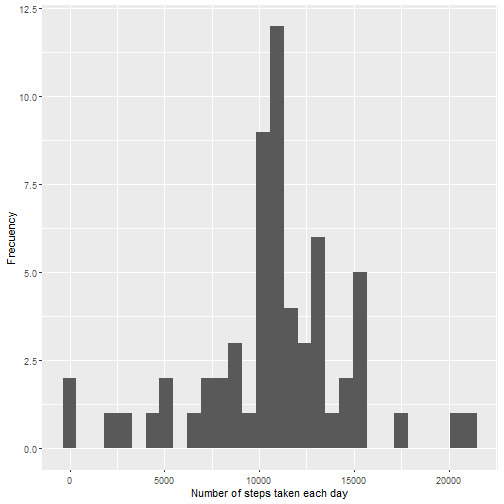
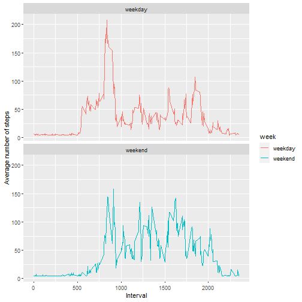

# Reproducible Research: Peer Assessment 1
Juan Rosa
1/1/2022

# Loading and preprocessing the data


```r
unzip(zipfile = "activity.zip")

ActData <- read.csv(file = "activity.csv", header = TRUE)

head(ActData)
```

```
##   steps       date interval
## 1    NA 2012-10-01        0
## 2    NA 2012-10-01        5
## 3    NA 2012-10-01       10
## 4    NA 2012-10-01       15
## 5    NA 2012-10-01       20
## 6    NA 2012-10-01       25
```


# What is mean total number of steps taken per day?

## Total number of steps taken per day


```r
library(dplyr)

TotalStepsDay <- ActData %>% select(date, steps) %>% group_by(date) %>%
  na.omit() %>% summarise(TotalSteps = sum(steps))

head(TotalStepsDay)
```

```
## # A tibble: 6 x 2
##   date       TotalSteps
##   <chr>           <int>
## 1 2012-10-02        126
## 2 2012-10-03      11352
## 3 2012-10-04      12116
## 4 2012-10-05      13294
## 5 2012-10-06      15420
## 6 2012-10-07      11015
```


## Histogram of the total number of steps taken each day


```r
library(ggplot2)

ggplot(data = TotalStepsDay, mapping = aes(x=TotalSteps)) + geom_histogram() +
  xlab("Total number of steps taken each day") + ylab("Frecuency")
```

```
## `stat_bin()` using `bins = 30`. Pick better value with `binwidth`.
```




## Mean and median of the total number of steps taken per day


```r
MeanMedianStepsDay <- TotalStepsDay %>% 
  summarise(MeanSteps = mean(TotalSteps), 
            MedianSteps = median(TotalSteps))
                     
print(MeanMedianStepsDay)
```

```
## # A tibble: 1 x 2
##   MeanSteps MedianSteps
##       <dbl>       <int>
## 1    10766.       10765
```


# What is the average daily activity pattern?

## Mean of steps taken per interval


```r
library(dplyr)

MeanStepsInterval <- ActData %>% select(interval, steps) %>%
  group_by(interval) %>% na.omit() %>%
  summarise(MeanSteps = mean(steps))

head(MeanStepsInterval)
```

```
## # A tibble: 6 x 2
##   interval MeanSteps
##      <int>     <dbl>
## 1        0    1.72  
## 2        5    0.340 
## 3       10    0.132 
## 4       15    0.151 
## 5       20    0.0755
## 6       25    2.09
```


## Time series plot of the 5-minute interval and the average number of steps taken, averaged across all days


```r
library(ggplot2)

ggplot(data = MeanStepsInterval, 
       mapping = aes(x = interval, y = MeanSteps)) + geom_line() +  
  xlab("5-minute interval") + ylab("Average number of steps taken")
```




## 5-minute interval, on average across all the days in the dataset, with the maximum number of steps


```r
library(dplyr)

MaxStepsInterval <- MeanStepsInterval %>% group_by(interval) %>%
  summarise(MaxSteps = max(MeanSteps)) %>% arrange(desc(MaxSteps))

head(MaxStepsInterval, 1)
```

```
## # A tibble: 1 x 2
##   interval MaxSteps
##      <int>    <dbl>
## 1      835     206.
```


# Imputing missing values

## Total number of missing values in the dataset


```r
MissData <- length(which(is.na(ActData$steps)))

print(MissData)
```

```
## [1] 2304
```


## Filling in all of the missing values in the dataset with the mean value of steps


```r
library(Hmisc)

ActDataNA <- ActData

ActDataNA$steps <- impute(x = ActDataNA$steps, fun = mean)
```


## New dataset with the missing data filled in


```r
head(ActDataNA)
```

```
##     steps       date interval
## 1 37.3826 2012-10-01        0
## 2 37.3826 2012-10-01        5
## 3 37.3826 2012-10-01       10
## 4 37.3826 2012-10-01       15
## 5 37.3826 2012-10-01       20
## 6 37.3826 2012-10-01       25
```


## Histogram of the total number of steps taken each day


```r
library(dplyr)

TotalStepsDayNA <- ActDataNA %>% select(date, steps) %>% group_by(date) %>%
  summarise(TotalSteps = sum(steps))


library(ggplot2)

ggplot(data = TotalStepsDayNA, mapping = aes(x = TotalSteps)) + geom_histogram() +
  xlab("Number of steps taken each day") + ylab("Frecuency")
```

```
## `stat_bin()` using `bins = 30`. Pick better value with `binwidth`.
```




## Mean and median of the total number of steps taken per day


```r
library(dplyr)

MeanMedianStepsDayNA <- TotalStepsDayNA %>% summarise(MeanSteps = mean(TotalSteps),
                                                MedianSteps = median(TotalSteps))

print(MeanMedianStepsDayNA)
```

```
## # A tibble: 1 x 2
##   MeanSteps MedianSteps
##       <dbl>       <dbl>
## 1    10766.      10766.
```

## Comparison between mean and median with and without missing data filled in


```r
print(MeanMedianStepsDay)
```

```
## # A tibble: 1 x 2
##   MeanSteps MedianSteps
##       <dbl>       <int>
## 1    10766.       10765
```

```r
print(MeanMedianStepsDayNA)
```

```
## # A tibble: 1 x 2
##   MeanSteps MedianSteps
##       <dbl>       <dbl>
## 1    10766.      10766.
```


# Are there differences in activity patterns between weekdays and weekends?

## New factor variable with two levels: weekday and weekend


```r
ActDataNA$date <- as.Date(ActDataNA$date)

ActDataNA$day <- weekdays(ActDataNA$date)

ActDataNA$week <- ifelse(ActDataNA$day == "Saturday" | 
                           ActDataNA$day == "Sunday",
                         "weekend", "weekday")

ActDataNA$week <- as.factor(ActDataNA$week)

head(ActDataNA)
```

```
##     steps       date interval    day    week
## 1 37.3826 2012-10-01        0 Monday weekday
## 2 37.3826 2012-10-01        5 Monday weekday
## 3 37.3826 2012-10-01       10 Monday weekday
## 4 37.3826 2012-10-01       15 Monday weekday
## 5 37.3826 2012-10-01       20 Monday weekday
## 6 37.3826 2012-10-01       25 Monday weekday
```


## Panel plot with a time series plot of the 5-minute interval and the average number of steps taken, averaged across all weekday days or weekend days


```r
library(dplyr)
MeanStepsDayWeek <- ActDataNA %>% group_by(interval, week) %>% 
  summarise(MeanSteps = mean(steps))
```

```
## `summarise()` has grouped output by 'interval'. You can override using the `.groups` argument.
```

```r
library(ggplot2)
ggplot(data = MeanStepsDayWeek, mapping = 
         aes(x = interval, y = MeanSteps, color = week)) +
  geom_line() + facet_wrap(~week, nrow = 2) + 
  xlab("Interval") + ylab("Average number of steps")
```


